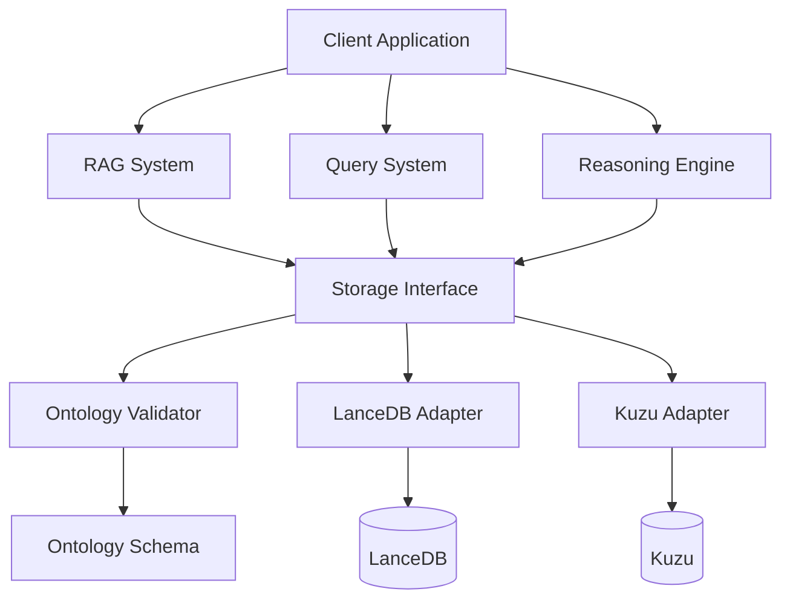

# VecnaDB Architecture

> **"Meaning lives in vectors. Truth lives in structure. VecnaDB enforces both."**

This document provides a comprehensive overview of VecnaDB's architecture, design principles, and implementation details.

---

## Table of Contents

1. [Overview](#overview)
2. [Core Principles](#core-principles)
3. [System Architecture](#system-architecture)
4. [Layer Details](#layer-details)
5. [Data Model](#data-model)
6. [Query Execution](#query-execution)
7. [Reasoning Engine](#reasoning-engine)
8. [RAG Pipeline](#rag-pipeline)
9. [Versioning System](#versioning-system)
10. [Security & Audit](#security--audit)

---

## Overview

VecnaDB is an **ontology-native hybrid vector-graph database** designed for AI applications that require both semantic search (vectors) and structural reasoning (graphs).

### Key Characteristics

- **Hybrid Storage**: LanceDB (vectors) + Kuzu (graph)
- **Dual Representation**: Every entity exists as both graph node AND vector embedding
- **Ontology-First**: All data must conform to declared schemas
- **Production-Ready**: Full versioning, audit logging, migration tools

---

## Core Principles

### 1. Dual Representation (Mandatory)

**Every entity MUST exist as both:**
- A typed node in the knowledge graph (Kuzu)
- Vector embeddings in the vector store (LanceDB)

```python
class KnowledgeEntity(BaseModel):
    # Graph representation
    graph_node_id: str  # REQUIRED - Kuzu node ID

    # Vector representation
    embeddings: List[EmbeddingRecord]  # REQUIRED - Must have ≥1 embedding

    @field_validator('embeddings')
    @classmethod
    def validate_embeddings_exist(cls, v):
        if not v or len(v) == 0:
            raise ValueError("Must have at least one embedding")
        return v
```

**Why?**
- Vectors provide semantic similarity
- Graphs provide structural truth
- Combined queries are more accurate than either alone

### 2. Graph is Authoritative

**Graph structure defines truth. Vectors are advisory.**

```python
# Graph reasoning produces FACTS (confidence = 1.0)
graph_result = await graph_reasoner.infer_relations(entity_id)
for fact in graph_result.inferred_relations:
    assert fact.confidence == 1.0  # Deterministic

# Vector reasoning produces SUGGESTIONS (confidence < 1.0)
vector_result = await vector_reasoner.find_similar_entities(entity)
for suggestion in vector_result.entity_suggestions:
    assert suggestion.confidence < 1.0  # Probabilistic
    assert suggestion.advisory_only == True
```

### 3. Ontology-First

**All data must conform to declared ontologies. No schema-less ingestion.**

```python
# This WILL FAIL if ontology not registered
await storage.add_entity(entity, validate=True)
# ValidationError: Entity type 'Unknown' not in ontology

# This WILL FAIL if required properties missing
entity.properties = {"name": "John"}  # Missing required 'email'
await storage.add_entity(entity, validate=True)
# ValidationError: Missing required property 'email'
```

### 4. Mandatory Explainability

**All operations must provide human-readable explanations.**

```python
# Query results include explanations
for result in search_results:
    print(result.explanation)
    # "Semantically similar (0.92) | Connected in graph (centrality: 0.85)"

# Reasoning includes inference paths
for fact in inferred_facts:
    print(fact.explanation)
    # "Inferred via transitivity: Cat → Mammal → Animal"

# RAG answers include provenance
for claim in grounded_claims:
    print(claim.source_explanation)
    # "Based on 3 relevant entities: [Doc1, Doc2, Doc3]"
```

---

## System Architecture

### Layered Architecture

```
┌──────────────────────────────────────────────────────────┐
│                  Application Layer                        │
│  ┌────────────┐ ┌──────────┐ ┌───────┐ ┌──────────────┐ │
│  │    RAG     │ │ Reasoning│ │ Query │ │ Versioning   │ │
│  │  System    │ │  Engine  │ │System │ │ & Audit      │ │
│  └────────────┘ └──────────┘ └───────┘ └──────────────┘ │
└──────────────────────────────────────────────────────────┘
                           ↓
┌──────────────────────────────────────────────────────────┐
│              Ontology & Validation Layer                  │
│  ┌──────────────┐ ┌──────────────┐ ┌─────────────────┐  │
│  │  Ontology    │ │  Validation  │ │   Constraint    │  │
│  │   Schema     │ │    Engine    │ │    Checking     │  │
│  └──────────────┘ └──────────────┘ └─────────────────┘  │
└──────────────────────────────────────────────────────────┘
                           ↓
┌──────────────────────────────────────────────────────────┐
│                  Storage Layer                            │
│  ┌──────────────────────────────────────────────────┐    │
│  │      VecnaDBStorageInterface (40+ methods)      │    │
│  │    (Unified API for graph + vector operations)  │    │
│  └──────────────────────────────────────────────────┘    │
│  ┌──────────────────────────────────────────────────┐    │
│  │           LanceDBKuzuAdapter                     │    │
│  │  (Dual Representation Enforcement)               │    │
│  └──────────────────────────────────────────────────┘    │
└──────────────────────────────────────────────────────────┘
                           ↓
┌────────────────────────┬─────────────────────────────────┐
│    LanceDB (Vectors)   │       Kuzu (Graph)              │
│  ┌──────────────────┐  │   ┌─────────────────────────┐   │
│  │  Embeddings      │  │   │  Typed Nodes            │   │
│  │  ANN Search      │  │   │  Typed Relations        │   │
│  │  Columnar Store  │  │   │  Graph Traversal        │   │
│  └──────────────────┘  │   └─────────────────────────┘   │
└────────────────────────┴─────────────────────────────────┘
```

### Component Interaction



---

## Layer Details

### Application Layer

#### RAG System (`vecnadb/modules/rag/`)

- **OntologyGuidedRAG**: Core RAG with ontology constraints
- **ContextValidator**: Validates retrieved context quality
- **HallucinationPrevention**: Detects fabricated information
- **AnswerGrounding**: Provides complete provenance with citations

**Key Features:**
- Intent-based retrieval (FACTUAL, EXPLORATORY, ANALYTICAL)
- Context validation (ontology compliance, quality scoring)
- Hallucination detection (6 types)
- Full provenance tracking

#### Reasoning Engine (`vecnadb/modules/reasoning/`)

- **GraphReasoner**: Deterministic inference from graph structure
- **VectorReasoner**: Probabilistic suggestions from embeddings
- **ReasoningEngine**: Orchestrates both approaches

**Reasoning Modes:**
- `GRAPH_ONLY`: Facts only (confidence = 1.0)
- `VECTOR_ONLY`: Suggestions only (confidence < 1.0)
- `HYBRID`: Both approaches in parallel
- `SEQUENTIAL`: Graph first, then vector

#### Query System (`vecnadb/modules/query/`)

- **HybridQueryBuilder**: Fluent API for building queries
- **HybridQueryExecutor**: 7-step execution pipeline
- Combines vector similarity + graph traversal
- Weighted ranking: `score = α·vector + β·graph`

#### Versioning & Audit (`vecnadb/modules/versioning/`)

- **EntityVersioning**: Complete version history
- **OntologyEvolution**: Schema versioning (semver)
- **MigrationTools**: Data migration execution
- **AuditLogger**: Full operation audit trail

### Ontology & Validation Layer

#### OntologySchema (`vecnadb/modules/ontology/models/`)

```python
class OntologySchema(BaseModel):
    id: UUID
    name: str
    version: str

    # Type definitions
    entity_types: Dict[str, EntityTypeDefinition]
    relation_types: Dict[str, RelationTypeDefinition]

    # Inheritance
    inheritance_graph: Dict[str, List[str]]

    # Global constraints
    global_constraints: List[Constraint]
```

**Features:**
- Multiple inheritance for entity types
- 8 constraint types (REGEX, RANGE, ENUM, etc.)
- Cardinality rules (ONE, ZERO_OR_ONE, etc.)
- Transitive and symmetric relation properties

#### OntologyValidator

Validates entities against ontology:
1. Entity type exists and not abstract
2. Required properties present
3. Property types match
4. Constraints satisfied
5. Embedding requirements met

### Storage Layer

#### VecnaDBStorageInterface

**Unified API with 40+ methods:**

```python
class VecnaDBStorageInterface(ABC):
    # Ontology management
    async def register_ontology(ontology: OntologySchema) -> UUID
    async def get_ontology(ontology_id: UUID) -> OntologySchema

    # Entity operations
    async def add_entity(entity: KnowledgeEntity, validate: bool) -> UUID
    async def get_entity(entity_id: UUID) -> KnowledgeEntity
    async def update_entity(entity: KnowledgeEntity, validate: bool)
    async def delete_entity(entity_id: UUID)  # Soft delete

    # Relation operations
    async def add_relation(...) -> UUID
    async def get_relations(...) -> List[Relation]
    async def delete_relation(relation_id: UUID)

    # Search operations
    async def vector_search(...) -> List[Tuple[KnowledgeEntity, float]]
    async def graph_search(...) -> Subgraph
    async def hybrid_search(...) -> List[SearchResult]

    # Graph operations
    async def extract_subgraph(...) -> Subgraph
    async def find_shortest_path(...) -> List[Relation]
    async def compute_centrality(entity_id: UUID) -> float

    # Batch operations
    async def batch_add_entities(entities: List[KnowledgeEntity])
    async def batch_add_relations(relations: List[Relation])
```

#### LanceDBKuzuAdapter

**Implementation enforcing dual representation:**

```python
class LanceDBKuzuAdapter(VecnaDBStorageInterface):
    async def add_entity(self, entity, validate=True):
        # 1. Validate dual representation
        if not entity.graph_node_id or not entity.embeddings:
            raise DualRepresentationError("Both graph and vector data required")

        # 2. Validate against ontology
        if validate:
            validator = self.validators[entity.ontology_id]
            result = await validator.validate_entity(entity)
            if not result.valid:
                raise ValidationError(result.errors)

        # 3. Atomic dual write (transaction)
        async with self._transaction():
            await self._add_to_graph(entity)   # Kuzu
            await self._add_to_vector(entity)  # LanceDB
```

---

## Data Model

### KnowledgeEntity

```python
class KnowledgeEntity(BaseModel):
    # Identity
    id: UUID = Field(default_factory=uuid4)
    type: str  # Logical type

    # Ontology enforcement
    ontology_id: UUID
    ontology_type: str  # Type from ontology
    ontology_valid: bool
    validation_errors: Optional[List[str]]

    # Temporal tracking
    created_at: datetime
    updated_at: datetime
    version: int = 1
    supersedes: Optional[UUID] = None  # Previous version

    # Graph representation (REQUIRED)
    graph_node_id: str  # Kuzu node ID

    # Vector representation (REQUIRED)
    embeddings: List[EmbeddingRecord]  # ≥1 embedding

    # Properties (ontology-constrained)
    properties: Dict[str, Any] = Field(default_factory=dict)

    # Provenance
    provenance: Optional[ProvenanceRecord] = None

    # Metadata
    metadata: Dict[str, Any] = Field(default_factory=dict)
```

### EmbeddingRecord

```python
class EmbeddingType(Enum):
    CONTENT = "content"    # Full content embedding
    SUMMARY = "summary"    # Summary/abstract embedding
    TITLE = "title"        # Title/name embedding
    ROLE = "role"          # Role/function embedding

class EmbeddingRecord(BaseModel):
    embedding_id: UUID
    embedding_type: EmbeddingType
    vector: List[float]  # Dense vector
    model: str  # e.g., "text-embedding-ada-002"
    dimensions: int
    created_at: datetime
```

### Relation

```python
class Relation(BaseModel):
    relation_id: UUID
    source_id: UUID
    target_id: UUID
    relation_type: str  # From ontology
    properties: Dict[str, Any]
    created_at: datetime
    ontology_id: UUID
```

---

## Query Execution

### Hybrid Query Pipeline (7 Steps)

```python
class HybridQueryExecutor:
    async def execute(self, query: HybridQuery) -> SearchResult:
        # 1. Embed query text
        query_vector = await self._embed_query(query.query_text)

        # 2. Vector similarity search
        vector_results = await self.storage.vector_search(
            query_vector=query_vector,
            entity_types=query.ontology_filter.allowed_entity_types,
            top_k=query.vector_search.top_k
        )

        # 3. Ontology filtering
        filtered = self._apply_ontology_filter(vector_results, query)

        # 4. Graph expansion
        expanded = await self._expand_with_graph(filtered, query)

        # 5. Hybrid ranking
        ranked = self._compute_hybrid_scores(expanded, query)

        # 6. Generate explanations
        with_explanations = self._add_explanations(ranked, query)

        # 7. Return bounded results
        return SearchResult(
            results=with_explanations[:query.output.max_results],
            query=query,
            execution_metadata=...
        )
```

### Ranking Formula

```python
combined_score = (
    weight_vector * vector_similarity_score +
    weight_graph * graph_centrality_score
)

# Default weights
weight_vector = 0.7
weight_graph = 0.3
```

---

## Reasoning Engine

### Architecture

```python
class ReasoningEngine:
    def __init__(self, storage, ontology, embedding_service):
        self.graph_reasoner = GraphReasoner(storage, ontology)
        self.vector_reasoner = VectorReasoner(storage, ontology, embedding_service)

    async def reason(
        self,
        entity_id: UUID,
        mode: ReasoningMode = ReasoningMode.HYBRID,
        max_depth: int = 3
    ) -> CombinedReasoningResult:
        result = CombinedReasoningResult(reasoning_mode=mode)

        if mode in [ReasoningMode.GRAPH_ONLY, ReasoningMode.HYBRID]:
            # Deterministic reasoning
            graph_result = await self.graph_reasoner.infer_relations(
                entity_id, max_depth
            )
            result.inferred_facts = graph_result.inferred_relations
            result.contradictions = graph_result.contradictions

        if mode in [ReasoningMode.VECTOR_ONLY, ReasoningMode.HYBRID]:
            # Probabilistic reasoning
            vector_result = await self.vector_reasoner.find_similar_entities(
                entity, top_k
            )
            result.entity_suggestions = vector_result.entity_suggestions

        return result
```

### Graph Reasoning (Deterministic)

**Inference Rules:**

1. **Transitive**: If R is transitive and A-R→B and B-R→C, then A-R→C
2. **Symmetric**: If R is symmetric and A-R→B, then B-R→A
3. **Cardinality**: Validate ONE, ZERO_OR_ONE, ZERO_OR_MORE, ONE_OR_MORE

**Example:**
```python
# Transitive inference on IS_A
# Setup: Cat IS_A Mammal, Mammal IS_A Animal
# Result: Cat IS_A Animal (inferred with confidence=1.0)

result = await graph_reasoner.infer_relations(cat_id, max_depth=3)
inferred = result.inferred_relations[0]

assert inferred.relation_type == "IS_A"
assert inferred.target_id == animal_id
assert inferred.confidence == 1.0  # Deterministic!
assert inferred.inference_type == InferenceType.TRANSITIVE
assert len(inferred.inference_path) == 2  # [Cat→Mammal, Mammal→Animal]
```

### Vector Reasoning (Probabilistic)

**Capabilities:**

1. **Similarity Search**: Find semantically similar entities
2. **Analogical Reasoning**: A:B :: C:? using vector arithmetic
3. **Type Inference**: Suggest types based on embedding clustering
4. **Relation Suggestions**: Suggest potential relation targets (advisory)

**Example:**
```python
# Analogical reasoning: "king:queen :: man:?"
# Vector arithmetic: woman = man + (queen - king)

result = await vector_reasoner.analogical_reasoning(
    entity_a=king,
    entity_b=queen,
    entity_c=man,
    top_k=5
)

top_suggestion = result.entity_suggestions[0]
assert top_suggestion.entity.properties["name"] == "woman"
assert top_suggestion.confidence < 1.0  # Probabilistic!
assert top_suggestion.suggestion_type == SuggestionType.ANALOGICAL
```

---

## RAG Pipeline

### Architecture

```python
class OntologyGuidedRAG:
    async def generate_answer(
        self,
        query: str,
        intent: QueryIntent,
        require_grounding: bool
    ) -> RAGAnswer:
        # 1. Retrieve context (ontology-validated)
        context = await self.retrieve_context(query, intent)

        # 2. Filter to high-quality context
        high_quality = context.get_high_quality_context(
            min_relevance=0.7,
            min_validity=0.9
        )

        # 3. Generate answer with LLM
        answer_text = await self._generate_with_llm(query, high_quality)

        # 4. Ground claims in knowledge graph
        grounded_claims = await self._ground_answer(answer_text, high_quality)

        # 5. Calculate confidence and hallucination risk
        confidence = self._calculate_confidence(grounded_claims)
        hallucination_risk = self._calculate_hallucination_risk(grounded_claims)

        # 6. Return answer with provenance
        return RAGAnswer(
            query=query,
            answer_text=answer_text,
            grounded_claims=grounded_claims,
            confidence=confidence,
            hallucination_risk=hallucination_risk
        )
```

### Hallucination Prevention

**Detection Methods:**

1. **Claim Extraction**: Parse answer into atomic claims
2. **Entity Grounding**: Verify all mentioned entities exist
3. **Relation Verification**: Check claimed relations in graph
4. **Fact Checking**: Compare claims to knowledge graph
5. **Consistency Checking**: Detect contradictions

**Hallucination Types:**
- `UNGROUNDED_CLAIM`: No source in context
- `FABRICATED_ENTITY`: References non-existent entity
- `FABRICATED_RELATION`: Claims non-existent relation
- `CONTRADICTORY_CLAIM`: Contradicts knowledge graph
- `UNSUPPORTED_INFERENCE`: Invalid inference
- `OVERCONFIDENT_CLAIM`: Claim stronger than evidence

**Risk Calculation:**
```python
detection_ratio = hallucinations_detected / total_claims
critical_ratio = critical_hallucinations / total_claims

risk = (detection_ratio * 0.6) + (critical_ratio * 0.4)

# Boost if many detections
if hallucinations > claims * 0.5:
    risk += 0.2

# Risk levels
# < 0.3: Low risk (trustworthy)
# 0.3-0.6: Moderate risk
# > 0.6: High risk (untrustworthy)
```

---

## Versioning System

### Entity Versioning

**Every change creates a new immutable version:**

```python
# Version 1: Create
v1 = await versioning.create_version(
    entity=entity,
    change_type=ChangeType.CREATE,
    change_source=ChangeSource.USER
)

# Version 2: Update
entity.properties["name"] = "Updated"
v2 = await versioning.create_version(
    entity=entity,
    change_type=ChangeType.UPDATE,
    change_source=ChangeSource.USER,
    previous_entity=v1.entity
)

# All versions preserved
history = await versioning.get_history(entity.id)
assert history.total_versions == 2
assert history.versions[0].version_number == 1
assert history.versions[1].version_number == 2
```

### Time-Travel Queries

```python
# Get entity state at specific time
past_entity = await versioning.get_entity_at_time(
    entity_id,
    datetime(2024, 1, 1, 12, 0, 0)
)

# Returns version that was current at that timestamp
```

### Ontology Evolution (Semantic Versioning)

```python
# MAJOR.MINOR.PATCH

# Breaking change → MAJOR bump
changes = [remove_entity_type("OldType")]
new_version = "2.0.0"

# New feature → MINOR bump
changes = [add_property("Person", "email")]
new_version = "1.1.0"

# Bug fix → PATCH bump
changes = [relax_constraint(...)]
new_version = "1.0.1"
```

---

## Security & Audit

### Audit Logging

**All operations logged:**

```python
class AuditLogger:
    async def log_entity_operation(operation, entity_id, actor, ...):
        event = AuditEvent(
            event_type=AuditEventType.ENTITY_UPDATE,
            actor=actor,
            resource_type="entity",
            resource_id=entity_id,
            before_state=old_entity.dict(),
            after_state=new_entity.dict(),
            timestamp=datetime.now()
        )
        await self._store_event(event)
```

**Event Types:**
- Entity ops: CREATE, READ, UPDATE, DELETE
- Query ops: QUERY_EXECUTE, SEARCH_EXECUTE
- RAG ops: RAG_QUERY, RAG_ANSWER_GENERATE
- Reasoning ops: REASONING_EXECUTE, INFERENCE_CREATE
- Schema ops: ONTOLOGY_UPDATE, ONTOLOGY_MIGRATE
- Security: AUTH_SUCCESS, AUTH_FAILURE, ACCESS_DENIED

**Audit Reports:**
```python
report = await logger.generate_report(
    start_time=month_start,
    end_time=month_end
)

print(f"Total events: {report.total_events}")
print(f"Failed operations: {report.failed_operations}")
print(f"Security incidents: {report.auth_failures}")
```

---

## Performance Optimizations

### Storage Layer

1. **Batch Operations**: Insert 100s of entities at once
2. **Index Strategy**: ANN indexes on vectors, B-tree on graph
3. **Caching**: Ontology validators cached per ontology
4. **Lazy Loading**: Load embeddings only when needed

### Query Execution

1. **Top-K Optimization**: Early termination in vector search
2. **Graph Pruning**: Ontology filters applied early
3. **Parallel Execution**: Vector + graph search in parallel
4. **Result Streaming**: Return results as available

### Reasoning Engine

1. **Memoization**: Cache inference results per entity
2. **Depth Limiting**: Configurable max depth to bound complexity
3. **Incremental Reasoning**: Only recompute for changed entities

---

## Deployment Architecture

### Single-Node Deployment

```
┌────────────────────────────────────┐
│         VecnaDB Instance           │
│                                    │
│  ┌──────────┐    ┌─────────────┐  │
│  │ LanceDB  │    │    Kuzu     │  │
│  │ (Vectors)│    │   (Graph)   │  │
│  └──────────┘    └─────────────┘  │
│                                    │
│  ./data/vectors   ./data/graph    │
└────────────────────────────────────┘
```

### Future: Distributed Deployment

```
┌─────────────┐    ┌─────────────┐    ┌─────────────┐
│  API Node 1 │    │  API Node 2 │    │  API Node 3 │
└─────────────┘    └─────────────┘    └─────────────┘
       │                  │                  │
       └──────────────────┴──────────────────┘
                          │
              ┌───────────┴───────────┐
              │                       │
      ┌───────▼────────┐    ┌────────▼───────┐
      │  Vector Cluster│    │  Graph Cluster │
      │   (LanceDB)    │    │    (Kuzu)      │
      └────────────────┘    └────────────────┘
```

---

## Summary

VecnaDB's architecture is built on five key pillars:

1. **Dual Representation**: Every entity as both graph node AND vector
2. **Ontology-First**: Strong schema enforcement at all layers
3. **Hybrid Queries**: Combined vector + graph for best results
4. **Reasoning**: Deterministic (graph) + probabilistic (vector)
5. **Traceability**: Complete versioning and audit trail

This architecture ensures that VecnaDB delivers both the semantic power of vector search and the structural guarantees of knowledge graphs.

**"Meaning lives in vectors. Truth lives in structure. VecnaDB enforces both."**
